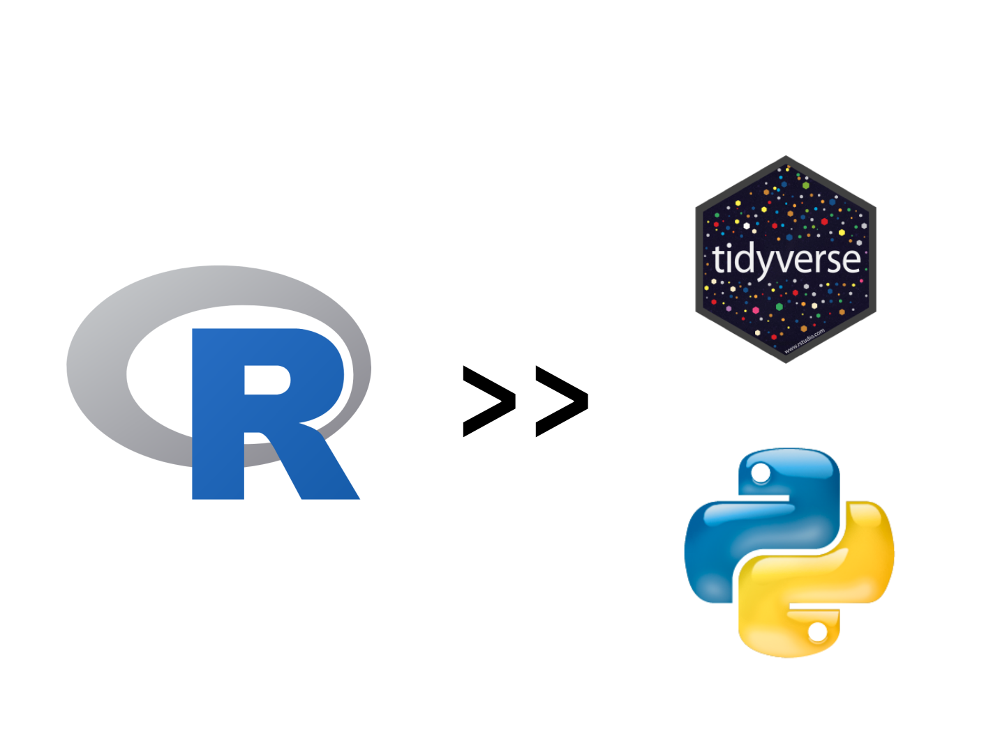
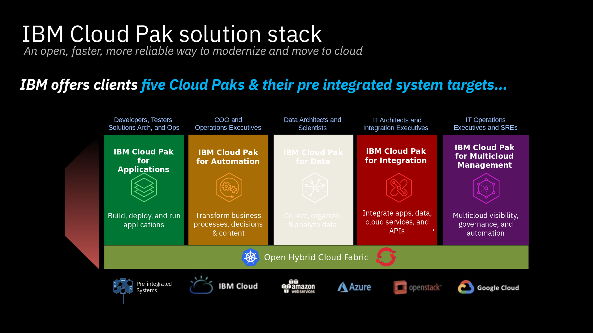

```{r setup, include=FALSE}
knitr::opts_chunk$set(echo = FALSE)
# library(RUGtools)
```
-->

# Agenda {.smaller}

0. Me
1. Lessons Learned
2. Containers
3. Kubernetes
4. Containers for Data Scientists
5. Q/A
6. Advertisement

## Troy Hernandez, PhD {.smaller}

<div class="columns-2">

*Education* - *UIC*

**Bachelors** - Philosophy/Mathematics

**Masters** - Game Theory/OR

**PhD** - Statistics/Machine Learning

<!-- **Vectorization Generalizations in Genomics and Transportation** w/ Jie Yang  -->

**Postdoc** - Tsinghua University, Beijing

*Professional*

**Civis Analytics** - Data Scientist

**Vivaki** - Data Scientist

**Sears Holdings** - Data Scientist

**IBM** - Open Source Analytics Technical Evangelist

**IBM** - Executive Architect

*Personal*

**Cubs MtG Music Politics**


</div>

# Lessons Learned

##


##


##


# Containers

## Docker {.flexbox .vcenter}


## Open Container Initiative {.flexbox .vcenter}


## Containers are Lightweight VMs! {.flexbox .vcenter}


## Containers are Lightweight VMs! {.flexbox .vcenter}

"*Virtual machines* are software computers that provide the same functionality as physical computers. Like physical computers, they run applications and an operating system. However, virtual machines are **computer files** that run on a physical computer and behave like a physical computer. In other words, virtual machines behave as separate computer systems."

https://www.vmware.com/topics/glossary/content/virtual-machine

## Image -> Container

For containers, those **computer files** are called *images*.

Containers are instantiations of an image.

## {.flexbox .vcenter}


https://www.docker.com/blog/containers-are-not-vms/

## Containers are not VMs {.flexbox .vcenter}


https://www.electronicdesign.com/dev-tools/what-s-difference-between-containers-and-virtual-machines

## {.flexbox .vcenter}


> "It’s an application-centric way to deliver high-performing, scalable applications on the infrastructure of your choosing."

https://www.docker.com/blog/containers-are-not-vms/

#

k8s


## {.flexbox .vcenter}


> "Kubernetes is an open-source container orchestration system for automating application deployment, scaling, and management"

## Kubernetes {.flexbox .vcenter}


# Containers for Data Scientists

## Use Case #1 - Reproducible Research

**Without Containers**

Have:

1. Code
2. Data

Don't Have:

1. Precise Version
2. Corresponding packages

## Use Case #1 - Reproducible Research

**Without Containers**



## Use Case #1 - Reproducible Research

**Without Containers**

```
> library("ggplot2")
Warning message:
package ‘ggplot2’ was built under R version 3.4.4
```

## Use Case #1 - Reproducible Research

**With Containers**

Everything is packaged up into an *immutable* image.

As long you can run the container, you can reproduce the research!

## Use Case #2 - Resources


## Use Case #2 - Resources {.smaller}

```
apiVersion: v1
kind: Pod
metadata:
  name: frontend
spec:
  containers:
  - name: db
    image: mysql
    env:
    - name: MYSQL_ROOT_PASSWORD
      value: "password"
    resources:
      requests:
        memory: "64Mi"
        cpu: "250m"
      limits:
        memory: "128Mi"
        cpu: "500m"
  - name: wp
    image: wordpress
    resources:
      requests:
        memory: "64G"
        cpu: "16"
      limits:
        memory: "128G"
        cpu: "16"
```

## Use Case #2 - Resources

Alternative:


> "Terraform is an open-source infrastructure as code software tool created by HashiCorp. It enables users to define and provision a datacenter infrastructure using a high-level configuration language known as Hashicorp Configuration Language, or optionally JSON."

## Use Case #3 - Microservices


## Use Case #3 - Microservices


## Use Case #3 - Microservices

R code as an API

<div class="columns-2">


</div>

## 10 Tricks to Appear Smart in Meetings

With Shiny on Kubernetes, your app *can* scale!


https://thecooperreview.com/10-tricks-appear-smart-meetings/

# Thank you

Questions?

# Advertisement

## Advertisement



## Advertisement

**Cloud Pak for Multicloud Management**

<div class="columns-2">

*Cloud Automation Manager*

built on open source:


*Ansible Tower*

built on open source:


</div>
